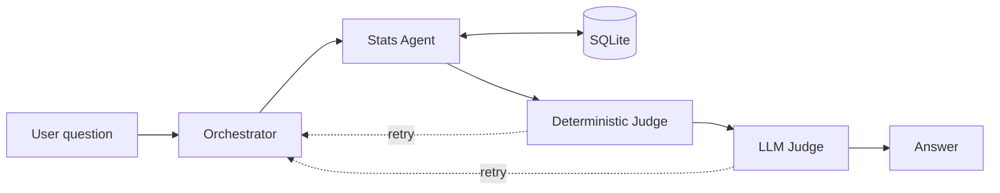

# AI Football Scout

A multi-agent system that searches Premier League players on behalf of a scout and verifies every number it reports against the source database before returning an answer.

> Status: actively in development. The core pipeline runs end to end. See [Roadmap](#roadmap).

## Why this project

Language models are unreliable with statistics. Asked about a player's goal count, a model will often produce a number that looks plausible and is wrong, with no signal that anything went wrong.

This project treats that as an engineering problem rather than a prompting problem. Generation and verification are separated into different components, and the verification step is not itself a language model. Numbers are extracted from the generated answer and compared against the database with exact arithmetic. If a number does not match, the answer is rejected and the task is sent back for rework.

### The scenario

The system is built around a concrete user. A Tottenham Hotspur scout looking for players worth signing. That keeps the questions realistic, the kind a scout would actually ask. Who is producing the most in front of goal per minute played. Which goalkeepers are performing above the shot volume they face. How two candidates compare on the same terms. It also forces the ranking logic to be defensible, because a scout asking who to buy needs a reason, not a list.

### Why football data

Football statistics are public, plentiful, and unambiguous. Every claim a model makes about them can be checked against a source, which makes the domain a good testbed for measuring hallucination and accuracy and for building the evaluation infrastructure around them.

The domain knowledge matters too. I follow the sport, so I can tell when an answer is subtly wrong and not only when it is obviously wrong. That is what surfaced most of the silent failures in this system.

The current scope is Premier League 2024-25 data with Tottenham as the scouting club. Both are boundaries of the current build, not of the design. The data layer was written so that another league is a configuration change rather than a rewrite, and the club only shapes the persona, not the retrieval or ranking logic.

## Architecture

The system follows an Orchestrator-Worker pattern with a two-stage verification loop.



**Orchestrator** (`orchestrator/pipeline.py`)
Connects the components and owns the retry loop. When a judge rejects an answer, the orchestrator passes the failure reason back to the agent and retries up to a bounded number of attempts.

**Stats Agent** (`agents/stats_agent.py`)
Retrieves player statistics using multi-round function calling against Gemini. The agent decides which tools to call and may call several in sequence before answering.

**Deterministic Judge** (`judges/deterministic.py`)
Pure Python, no model call. Extracts every numeric claim from the generated answer with regular expressions and checks each one against the database using `math.isclose()`. This catches fabricated numbers mechanically and costs nothing per call.

**LLM Judge** (`judges/llm_judge.py`)
Catches the failures the deterministic judge cannot see, where the numbers are correct but the interpretation is not. Returns a structured JSON verdict so the orchestrator can act on it programmatically.

## Evaluation

The system is tested at three levels rather than by manual inspection.

| Layer | File | What it checks |
| --- | --- | --- |
| Output quality | `eval/evaluate.py` | Runs a golden dataset of question and answer pairs, reports a pass rate, and exits non-zero when the pass rate falls below the threshold |
| Agent behaviour | `eval/evaluate_trajectory.py` | Compares the set of tools the agent actually called against the expected set, verifying reasoning path without any additional model calls |
| Scoring logic | `eval/test_ranking.py` | Unit tests that lock in the ranking formulas, covering returned values and not only rank order |

Failures in the golden dataset run are isolated per case so that one bad case does not abort the run. Requests are spaced out to avoid API rate limiting, which otherwise surfaces as a silent wrong result rather than an error.

## Data

Premier League 2024-25 player statistics from FBref, retrieved through [`soccerdata`](https://github.com/probberechts/soccerdata) with a local cache and built into a SQLite database by `data/build_db.py`.

The schema is split by player role rather than by position.

| Table | Columns | Contents |
| --- | --- | --- |
| `outfield` | 47 | Standard, shooting, miscellaneous, and playing time statistics joined per player |
| `keepers` | 33 | Goalkeeping statistics |

Positions are the data provider's classification and are frequently ambiguous, so they are not used as a structural boundary. Role is unambiguous, which makes it a safer key for splitting the tables. The tables are denormalised at build time because the workload is read only and the row counts are small.

## Ranking

Players are scored with shrinkage-adjusted rates rather than raw per 90 figures. A player with 90 minutes of football and one goal has a raw rate that looks elite and means nothing. Each player's rate is pulled toward the league average by a fixed number of phantom observations, so small samples regress to the mean and large samples are barely affected.

- Outfield players are scored on non-penalty goals and assists per 90, with K set to 15 phantom appearances against a league average baseline.
- Goalkeepers are scored on saves divided by shots on target against, with K set to 50 phantom shots at the league average save rate.

Clean sheets are excluded because they measure the defence more than the keeper. FBref's own save percentage column is excluded because it does not handle low volume keepers.

## Project structure

```
agents/          Stats Agent and its tool definitions
judges/          Deterministic and LLM verification
orchestrator/    Pipeline and retry loop
data/            Database build script and SQLite file
eval/            Golden dataset, trajectory, and unit tests
notebooks/       Prototyping and exploration
```

## Getting started

Requires Python 3.12 and a Gemini API key.

```bash
git clone https://github.com/Jade-ok/AI-Football-Scout.git
cd AI-Football-Scout
pip install -r requirements.txt
export GEMINI_API_KEY=your_key_here
```

Build the database. This downloads from FBref on first run and caches locally.

```bash
python data/build_db.py
```

Run the pipeline.

```bash
python orchestrator/pipeline.py
```

Run the evaluations.

```bash
python eval/evaluate.py
python eval/evaluate_trajectory.py
python -m pytest eval/test_ranking.py
```

## Roadmap

Working today.

- End to end pipeline with retry loop
- Stats Agent with multi-round function calling
- Deterministic and LLM judges
- Golden dataset, trajectory, and unit test evaluation

Planned.

- A `sort_by` parameter, so that "find me a striker" and "find me a creative player" are not collapsed into one combined score
- Analysis Agent for longer scouting reports
- 2025-26 season data
- Input validation and prompt injection handling
- Additional leagues, starting with La Liga and then MLS
- Configurable club, so the scout persona is not fixed to one team

## Notes on design

A few decisions worth recording, since the reasoning matters more than the result.

Running without an error is not the same as producing a correct answer. The real risk in this system is silent failure, a wrong ranking or a query against the wrong table, so the tests deliberately include broken inputs and expected failures.

Constraining the producer is cheaper than catching the producer. Several classes of hallucination disappeared once the system prompt forbade the shapes of output that caused them, which means the retry loop never has to run.

A passing test suite can still miss a regression. Rank order tests survived a formula swap that changed every underlying value, which is why the ranking tests now assert on values as well.

## License

MIT