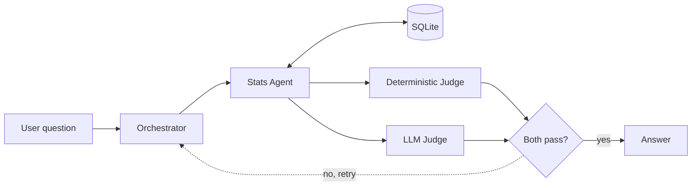

# AI Football Scout

An agent system that searches Premier League players on behalf of a scout and checks every number in its answer against the data it retrieved before returning it.

> Status: actively in development. The core pipeline runs end to end. See [Roadmap](#roadmap).

## Why this project

Language models are unreliable with statistics. Asked about a player's goal count, a model will often produce a number that looks plausible and is wrong, with no signal that anything went wrong.

This project treats that as an engineering problem rather than a prompting problem. Generation and verification are separated into different components, and the first verification step is not itself a language model. Numbers are extracted from the generated answer and compared against the retrieved database records in plain Python. If a number does not match, the answer is rejected and the task is sent back for rework.

### The scenario

The system is built around a concrete user. A Tottenham Hotspur scout looking for players worth signing. That keeps the questions realistic, the kind a scout would actually ask. Who is producing the most in front of goal per minute played. Which goalkeepers are performing above the shot volume they face. How two candidates compare on the same terms. It also forces the ranking logic to be defensible, because a scout asking who to buy needs a reason, not a list.

### Why football data

Football statistics are public, plentiful, and unambiguous. Every claim a model makes about them can be checked against a source, which makes the domain a good testbed for measuring hallucination and accuracy and for building the evaluation infrastructure around them.

The domain knowledge matters too. I follow the sport, so I can tell when an answer is subtly wrong and not only when it is obviously wrong. That is what surfaced most of the silent failures in this system.

The current scope is Premier League 2024-25 data with Tottenham as the scouting club. Both are boundaries of the current build, not of the design. Every row carries competition and season columns and all reads go through one query layer, so another league means new data and recomputed league averages rather than a redesign. The club only shapes the persona, not the retrieval or ranking logic.

## Architecture

The system follows an Orchestrator-Worker pattern with a two-judge verification loop.



**Orchestrator** (`orchestrator/pipeline.py`)
Connects the components and owns the retry loop. Both judges run on every answer and their verdicts are combined, so a single failure on either side rejects the answer. On rejection the orchestrator appends the specific unverified numbers to the question and asks again, for two attempts in total. If the last attempt still fails, the answer is returned with a warning rather than hidden. Questions that trigger no tool call have nothing to verify and are returned unchecked with an explicit `not_applicable` verdict rather than a silent pass.

**Stats Agent** (`agents/stats_agent.py`)
Retrieves player statistics using multi-round function calling against Gemini. The agent decides which tools to call and may call several in sequence, up to five rounds, before answering.

**Deterministic Judge** (`judges/deterministic.py`)
Pure Python, no model call. Extracts every numeric claim from the generated answer with regular expressions and checks each one against the tool results the agent received using `math.isclose()` with a 1 percent relative tolerance. Season notations and numbers echoed from the question are not treated as claims. This catches fabricated numbers mechanically and costs nothing per call.

**LLM Judge** (`judges/llm_judge.py`)
Catches the failures the deterministic judge cannot see, where the numbers are correct but the interpretation is not. Returns a structured JSON verdict so the orchestrator can act on it programmatically. It currently checks the answer against the first tool result only.

## Evaluation

The system is tested at three levels rather than by manual inspection.

| Layer | File | What it checks |
| --- | --- | --- |
| Judge accuracy | `eval/evaluate.py` | Runs the LLM judge over 9 pre-written answers labelled pass or fail, reports how often its verdict matches the label, and exits non-zero when that rate falls below 88 percent |
| Agent behaviour | `eval/evaluate_trajectory.py` | Asks the agent 4 questions and compares the set of tools it actually called against the expected set. The final answer is not judged, so no judge model call is needed. Exits non-zero unless every case passes |
| Scoring logic | `eval/test_ranking.py` | 7 assertions that lock in the ranking formulas, checking recomputed score values and not only rank order. No API calls, runs in milliseconds |

Failures in both API-backed runs are isolated per case so that one bad case does not abort the run, and API errors are reported separately from genuine mismatches because both lower the pass rate for very different reasons. Requests are spaced out to avoid rate limiting, which otherwise shows up as a pass rate drop that has nothing to do with the judge or the agent.

## Data

Premier League 2024-25 player statistics from FBref, retrieved through [`soccerdata`](https://github.com/probberechts/soccerdata) with a local cache and built into a SQLite database by `data/build_db.py`.

The schema is split by player role rather than by position.

| Table | Rows | Columns | Contents |
| --- | --- | --- | --- |
| `outfield` | 530 | 47 | Standard, shooting, miscellaneous, and playing time statistics joined per player and club |
| `keepers` | 44 | 33 | Goalkeeping and playing time statistics |

A player who moved clubs mid-season has one row per club, so transfers are never merged into a single total.

Positions are the data provider's classification and are frequently ambiguous (FBref lists Mohamed Salah as a midfielder), so beyond separating goalkeepers they are used only as a loose search filter, not as a structural boundary. Role is unambiguous, which makes it a safer key for splitting the tables. The tables are denormalised at build time because the workload is read only and the row counts are small.

## Ranking

Attackers and goalkeepers are scored with shrinkage-adjusted rates rather than raw per 90 figures. A player with 90 minutes of football and one goal has a raw rate that looks elite and means nothing. Each player's rate is pulled toward the average by a fixed number of phantom observations, so small samples regress to the mean and large samples are barely affected.

- Forwards and midfielders are scored on non-penalty goals and assists per 90, with K set to 15 phantom full matches at 0.315, the average for forward and midfield players with at least 900 minutes. A forward search also includes midfield-labelled players, so attackers like Salah are not missed.
- Goalkeepers are scored on saves divided by shots on target against, with K set to 50 phantom shots at a 68.1 percent save rate, the average for keepers with at least 900 minutes.
- Defenders are currently ranked on raw tackles won plus interceptions per 90, without shrinkage.

Every search applies a 900 minute floor by default. The averages are fixed constants for 2024-25 and need recomputing when the season changes.

Clean sheets are excluded because they measure the defence more than the keeper. FBref's own save percentage column is excluded because it is derived from goals against, which includes own goals the keeper had no chance to save. Bart Verbruggen's FBref figure is 58.6 percent, while his saves over shots on target come to 63.6 percent.

## Project structure

```
agents/
  stats_agent.py          Function calling agent over the stats tools
judges/
  deterministic.py        Regex extraction and numeric verification
  llm_judge.py            Structured JSON verdict on reasoning
orchestrator/
  pipeline.py             scout_pipeline and scout_with_retry
data/
  build_db.py             Builds stats.db from the FBref cache
  loader.py               Query layer, get_player_stats and find_players
eval/
  evaluate.py             Golden dataset run with a pass-rate gate
  evaluate_trajectory.py  Tool selection comparison
  test_ranking.py         Ranking formula assertions
  golden_dataset.json     Labelled answers with expected judge verdicts
  trajectory_dataset.json Expected tool calls per question
notebooks/                Prototyping, one notebook per component
```

The data source sits behind `loader.py`, so storage can change without touching the agent, the judges, or the pipeline.

## Getting started

Requires Python 3.12 and a Gemini API key.

```bash
git clone https://github.com/Jade-ok/AI-Football-Scout.git
cd AI-Football-Scout
pip install -r requirements.txt
export GEMINI_API_KEY=your_key_here
```

The key can also go in a `.env` file at the project root.

Build the database. This downloads from FBref on first run and caches locally. It only needs to be rerun for a new season or a new stat table.

```bash
python data/build_db.py
```

Ask a question. The pipeline is a library module, so it is imported rather than run as a script.

```python
from orchestrator.pipeline import scout_with_retry

result = scout_with_retry("Which forwards had the best minutes-adjusted output in the 2024-25 season?")
print(result["answer"], result["verdict"], result["attempts"])
```

Run the evaluations from the project root.

```bash
python -m eval.evaluate
python -m eval.evaluate_trajectory
python -m eval.test_ranking
```

The two API-backed evaluations pause between cases to stay under the rate limit. Override the interval with `EVAL_DELAY` in seconds, which is useful when a higher quota is available.

```bash
EVAL_DELAY=2 python -m eval.evaluate
```

## Roadmap

### Working today

- End to end pipeline with a retry loop and combined judge verdicts
- Stats Agent with multi-round function calling
- Deterministic and LLM judges
- Golden dataset, trajectory, and ranking evaluation with a pass-rate gate

### Next

- A `sort_by` parameter, so that "find me a striker" and "find me a creative player" are not collapsed into one combined score
- Revised ranking formulas using shooting quality and playing time weighting, rather than output volume alone
- Multi-source reasoning verification, so answers built from several lookups are checked against every source instead of the first one
- Migration of the ranking assertions to pytest, for parameterised cases and standard reporting
- 2025-26 season data

### Later

- Analysis Agent that turns verified statistics into a written scouting report
- Continuous integration that runs the evaluation suite on every push and blocks a merge when the pass rate drops
- Input validation and prompt injection handling
- Additional leagues, starting with La Liga and then MLS
- Configurable club, so the scout persona is not fixed to one team

## Notes on design

A few decisions worth recording, since the reasoning matters more than the result.

Running without an error is not the same as producing a correct answer. The real risk in this system is silent failure, a wrong ranking or a query against the wrong table, so the tests deliberately include broken inputs and expected failures.

Constraining the producer is cheaper than catching the producer. Several classes of hallucination stopped appearing in development runs once the system prompt forbade the shapes of output that caused them, so the retry loop no longer has to catch them. This has not yet been measured against the earlier prompt.

A passing test suite can still miss a regression. The rank order checks, Salah first and Muniz outside the top ten, still pass when the formula is switched from non-penalty goals back to goals, even though that changes the score of every penalty taker and reshuffles the top ten. That is why the ranking tests now assert on values as well.
